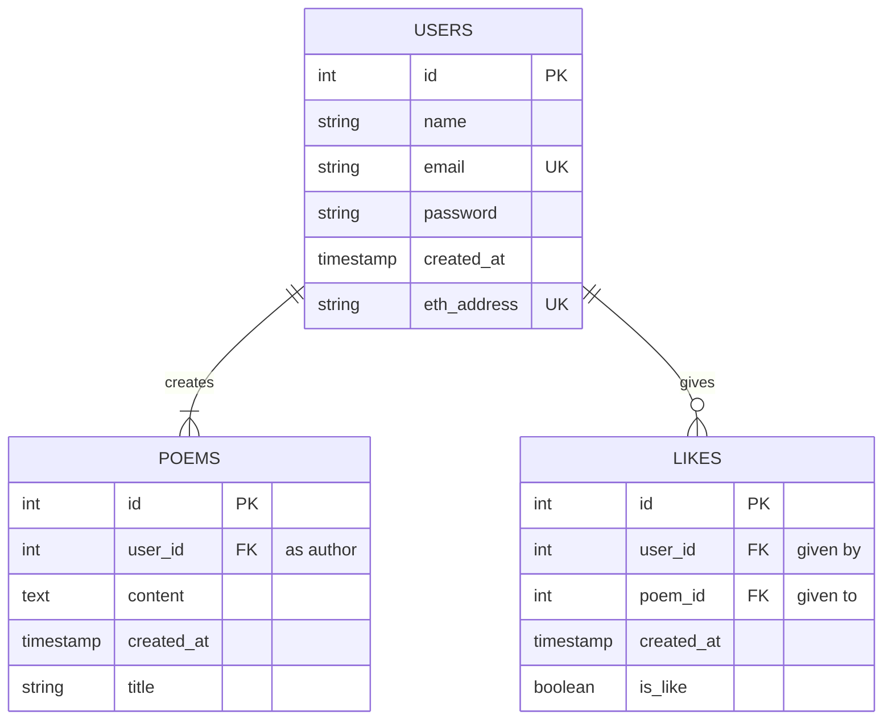

# We've Got Poems - Backend

## How to Run

### Configuring Environment Variables

To configure the environment variables, follow these steps:

1. Copy the `.env.example` file to `.env`.
2. Open the `.env` file and fill in the values for each variable.

Make sure to provide the appropriate values for the variables based on your specific setup.

### Install Dependencies

```bash
npm install
```

### Run the Server

```bash
npm start
```

### Run the database

#### Using Docker

run the following command to start a postgres container with docker
docker run --env=POSTGRES_PASSWORD=1234 --env=POSTGRES_USER=postgres --env=POSTGRES_DB=postgres -p 5432:5432 postgres:latest

#### Another database

If you want to use another database, you can change the values in the .env file

## Database Diagram


