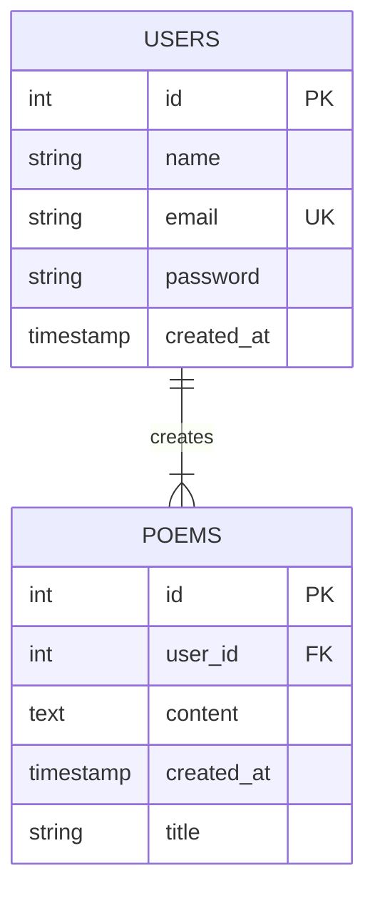

# We've Got Poems - Backend

## How to Run

### Ask for the `.env` file

This file is not included in the repository for security reasons.
Ask a member of the team for the file.

### Install Dependencies

```bash
npm install
```

### Run the Server

```bash
npm start
```

---

## Database Diagram


